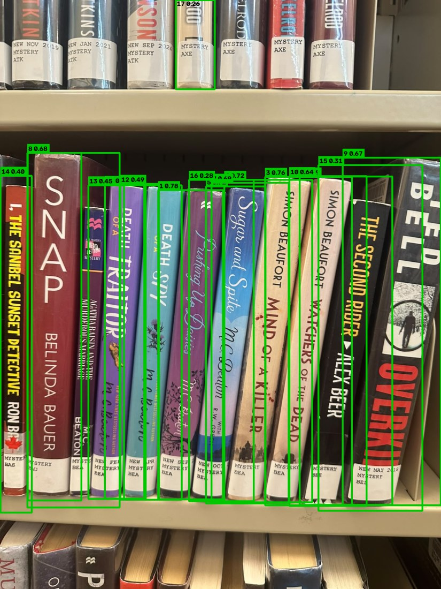

# Shelfie — Bookshelf → Library Inventory

Take a photo of a bookshelf. Get back a structured list of books, matched against a canonical
catalog, with a confidence score on every row. Confirm the ones you want, and they persist to
your library.

```
Expo app  ──photo──▶  Django REST API  ──▶  YOLOv8n (local, CPU)  ──▶  spine crops
                                                                          │
                                                    hosted vision-language model (OpenAI)
                                                                          │
                                                             title + author per spine
                                                                          │
                                                    fuzzy match vs catalog.csv (320 entries)
                                                                          │
                                        high ──▶ pre-selected   review ──▶ user decides   unmatched ──▶ user decides
                                                                          │
                                                                   SQLite library
```

**Status: working end to end.** Photo in, matched books out, confirmed books persist. 


---

## 1. What you need before you start

| Tool | Version I used | Why |
|------|----------------|-----|
| Python | 3.13.1 | backend + both models' glue code |
| Node.js | 24.19.0 | to run the Expo CLI |
| An OpenAI API key | — | the hosted vision-language model. **The backend will not start without it** 
| A phone with Expo Go, **or** an Android/iOS simulator | Expo SDK 54 | to run the app |

You do **not** need a GPU. All local inference is CPU-only, which is what the task asked for.
You do **not** need to download model weights — `backend/yolov8n.pt` (6.5 MB) is committed to the
repo, so a clean clone works without an extra download step.


---

## 2. Quick start: clean clone to running app

Every command below is written out in full. If you are new to Django or Expo, run them in order and
don't skip any.

### 2.1 Get the code

```bash
git clone <your-repo-url> shelfie
cd shelfie
```

### 2.2 Backend: create a virtual environment and install

A *virtual environment* is a private folder of Python packages for this project only, so it can't
collide with anything else on your machine.

**macOS / Linux**

```bash
cd backend
python3 -m venv .venv
source .venv/bin/activate
pip install -r requirements.txt
```

**Windows (PowerShell)**

```powershell
cd backend
python -m venv .venv
.\.venv\Scripts\Activate.ps1
pip install -r requirements.txt
```

You'll know the venv is active because your prompt is prefixed with `(.venv)`. Every backend command
from here on assumes it's active.

### 2.3 Set your API key (required)

```bash
# from the backend/ directory
cp .env-example .env        # Windows PowerShell: Copy-Item .env-example .env
```

Then open `backend/.env` and put your real key in:

```
OPENAI_API_KEY=sk-...
```

> **This is not optional and it is not lazy.** `scans/pipeline/vlm.py` constructs the OpenAI client
> at module import time, and `scans/views.py` imports it, so Django fails to start at all if the key
> is missing. The error you'd see is:
> `OpenAIError: Missing credentials. Please pass an api_key ... or set the OPENAI_API_KEY environment variable.`
> If you see that, your `.env` is missing or in the wrong directory. It belongs in `backend/.env`,
> next to `manage.py`. 

### 2.4 Create the database and start the server

```bash
python manage.py migrate
python manage.py runserver 0.0.0.0:8000
```

`migrate` creates `backend/db.sqlite3` with two tables (`Scan`, `LibraryEntry`). The database file is
gitignored, so you always start from an empty library — that's intentional, so a grader's first run
is clean.

`0.0.0.0` (rather than the default `127.0.0.1`) makes the server reachable from your phone over
Wi-Fi. Without it, the phone gets a connection refused.

**Check it works.** Open <http://localhost:8000/api/> in a browser. You should see:

```json
{
  "service": "shelfie-api",
  "status": "ok",
  "project_root": "...",
  "endpoints": { "scan": "http://localhost:8000/api/scans/", "library": "http://localhost:8000/api/library/" }
}
```

`project_root` is in there deliberately: if two copies of this project are ever running on port
8000, that field is the only quick way to tell which one answered you.

### 2.5 Mobile app

In a **second terminal**, leave the backend running and:

```bash
cd mobile
npm install
```

Now open `mobile/api.js` and change the first line to your computer's LAN IP:

```js
export const BASE = "http://192.168.1.42:8000";   // ← your machine's IP, not mine
```

See [section 3](#3-connecting-the-phone-to-the-backend-the-step-that-trips-everyone-up) for how to
find that IP. Then:

```bash
npx expo start
```

Scan the QR code with Expo Go (Android) or the Camera app (iOS). Press **Pick photo**, choose one of
the shelf photos in [`photos/`](photos/), and wait — a busy 20-shelf photo takes about a minute, and
[section 7](#7-measured-latency-and-cost) explains exactly where that minute goes.

---

## 3. Connecting the phone to the backend (the step that trips everyone up)

The phone and the laptop are two different computers. `localhost` on the phone means *the phone*, so
the app has to be pointed at the laptop's address on the local network.

**Find your machine's LAN IP:**

| OS | Command | Look for |
|----|---------|----------|
| Windows | `ipconfig` | "IPv4 Address" under your active Wi-Fi adapter |
| macOS | `ipconfig getifaddr en0` | the whole output |
| Linux | `hostname -I` | the first address |

Put that address into `mobile/api.js` as shown above, then restart Expo.

**Checklist when you get `Network request failed`:**

1. Phone and laptop on the **same Wi-Fi network** (a phone on cellular data cannot see your laptop).
2. Backend started with `runserver 0.0.0.0:8000`, not plain `runserver`.
3. `BASE` in `mobile/api.js` has no trailing slash and includes `:8000`.
4. Your OS firewall is allowing inbound connections on port 8000 — on Windows this prompts the first
   time and it is easy to click "Cancel" by reflex.
5. Sanity check from the phone's browser: open `http://<your-ip>:8000/api/`. If that JSON doesn't
   load in the phone's browser, the problem is the network, not the app.

`ALLOWED_HOSTS = ["*"]` is already set in `backend/config/settings.py` so Django accepts requests
addressed to a raw IP. That is a development-only setting and is fine here — it would not be fine in
production.

---

## 4. What the spine detector actually sees

This is the raw output of the local model, before anything is sent to a hosted API. Green boxes are
the regions YOLOv8n classified as COCO class 73 (`book`); the label on each box is
`<index> <detection confidence>`.



*Generated from [`photos/12.jpg`](photos/12.jpg) — 18 boxes, detection confidence 0.26–0.78.*


## 5. Architecture, explained from scratch

This section assumes you know what an HTTP request is and not much else about this stack.

### 5.1 The two halves

The repo is two independent programs that talk over HTTP:

* **`mobile/`** — a React Native app run through Expo. It draws the UI and makes `fetch` calls. It
  contains no matching logic and no model code at all. It is deliberately thin.
* **`backend/`** — a Django project. It receives the photo, runs the whole pipeline, and owns the
  database.

Keeping *all* intelligence server-side is the main structural decision in the project. The phone
never sees the catalog, never runs a model, and never computes a score. That means the matching
logic can be changed and re-measured without rebuilding the app — which matters a lot when you're
iterating on scoring under a deadline.

### 5.2 Django project layout, for anyone new to Django

A Django *project* is the container; a Django *app* is a module inside it.

```
backend/
├── manage.py              # the command-line entry point: migrate, runserver, ...
├── config/                # the PROJECT: settings and the root URL table
│   ├── settings.py        # database, installed apps, MEDIA_ROOT, upload size limits
│   └── urls.py            # routes /api/... into the scans app; serves /media/ in DEBUG
└── scans/                 # the APP: everything Shelfie-specific
    ├── models.py          # database tables, defined as Python classes
    ├── views.py           # the HTTP endpoints
    ├── serializers.py     # turns model objects into JSON
    ├── urls.py            # the app's own URL table
    └── pipeline/          # plain Python, no Django imports except settings — the actual work
```

The important boundary is `scans/pipeline/`. Those modules are ordinary functions taking and
returning plain dicts. They know nothing about HTTP. That is what makes the matcher unit-testable
without spinning up a server or a database — see [section 12](#12-tests).


## 6. Local vs hosted: what runs where and why

| Stage | Where | Model | Why there |
|-------|-------|-------|-----------|
| Find the spines | **Local**, CPU | YOLOv8n (COCO, off-the-shelf) | "Where are the rectangles" is a solved localisation problem. It costs 159 ms and $0 locally. Paying a hosted model to do it would add a network round trip and a per-image fee for a worse answer, because a VLM asked for bounding boxes returns approximate coordinates. |
| Read the text on each spine | **Hosted** | OpenAI vision-language model | Spine text is rotated 90°, arched over cover art, in mixed fonts, at low resolution. Classical OCR (I tried Tesseract's mental model first) needs deskewing per spine and still fails on stylised type. A VLM reads it and *also* structures it into `{title, author}` in a single call, which a plain OCR pass does not. |
| Match to the catalog | **Local**, no model | rapidfuzz | Deterministic, testable, 9 ms per book, free. Asking an LLM "which catalog entry is this?" would cost money per book, be non-reproducible run to run, and be impossible to unit-test — and this is the part of the task most worth being able to defend line by line. |

---

## 8. The catalog: how I built it, and what I broke on purpose

`catalog.csv` — **320 entries**, well past the 100 minimum.

### 8.1 Where the data came from

**I built it from my own photographs, not from a public dataset or a model's memory.** I went to my
local Toronto Public Library branch and photographed shelves — the 23 images in [`photos/`](photos/)
are those photos, and they are the same images the pipeline is benchmarked on. I then transcribed
the titles and authors off those spines to form the catalog.

That decision is the single most useful thing I did for this task, for one reason: **the catalog and
the test images come from the same real-world distribution.** It is mid-list contemporary fiction —
Grisham, Lee Child, M. C. Beaton, Louise Penny, Val McDermid, Simon Beaufort — which is exactly what
a public library shelf and a normal person's shelf actually hold. A catalog assembled from a
"best books of all time" list would look impressive and match nothing.

### 8.2 About `catalog1.csv`

`catalog1.csv` (126 entries) is my **first draft**: a purely LLM-generated catalog of well-known
titles, produced before I had my own photos. It is **not loaded by the application** —
[`catalog.py`](backend/scans/pipeline/catalog.py) resolves `catalog.csv` only. I've left it in the
repo because the diff between the two files is an honest record of the biggest single improvement
in this project: replacing a plausible-looking synthetic catalog with one built from the same shelves
I test against. Delete it if it's noise to you.

---

## 9. Tests

```bash
cd backend
pytest -q                          # 22 tests
pytest scans/tests/test_matcher.py -v   # named, one line each
```

## 10. API reference

Base URL `http://<host>:8000/api/`.

### `GET /api/` — health check
Returns service status and the endpoint URLs. Useful for confirming the phone can reach the backend.

### `POST /api/scans/` — scan a photo
`multipart/form-data`, one field: `image`.

```jsonc
{
  "scan_id": 12,
  "detections": [
    {
      "box": [412, 233, 468, 951],           // x1, y1, x2, y2 in the original image
      "detection_confidence": 0.68,          // YOLO's confidence (local model)
      "raw_read": { "title": "Dune", "author": "Frank Herbert" },  // exactly what the VLM said
      "match": {
        "catalog_id": "bk_305",
        "title": "Dune",                     // the CANONICAL title, not the read
        "author": "Frank Herbert",
        "score": 1.0,                        // 0..1 combined title+author score
        "margin": 0.0,                       // score gap to the runner-up
        "status": "review"                   // "high" | "review" | "unmatched"
      },
      "alternates": [                        // up to 3, only if they scored >= 0.60
        { "catalog_id": "bk_306", "title": "Dune", "score": 1.0 }   // the other edition
      ]
    }
  ],
  "errors": [                                // per-stage, non-fatal; results still present
    { "stage": "vlm", "detail": "Malformed response for spine: .../spine_12.jpg" }
  ],
  "timings_ms": { "detect": 166.7, "vlm": 46492.3, "match": 164.0 }
}
```

`raw_read` and `match` are both returned on purpose: the app can show what the model *read* next to
what it was *matched to*, which is the information a human needs to judge a low-confidence row.

Returns `400` only when no image is supplied. Every other failure returns `200` with the detail in
`errors[]` — see [section 11](#11-graceful-failure).

### `POST /api/library/` — confirm books
```json
{ "scan_id": 12,
  "books": [ { "catalog_id": "bk_203", "title": "Snap", "author": "Belinda Bauer" } ] }
```
`catalog_id` may be `null`/`""` for a book with no catalog match. Returns `201` with the created rows.

### `GET /api/library/` — list the library
Returns all confirmed entries, newest first.

---

## 15. Repository map

```
shelfie/
├── catalog.csv                    ★ the catalog — 320 entries (section 8)
├── catalog1.csv                     first-draft LLM catalog, NOT loaded (section 8.4)
├── photos/                        ★ the 23 TPL shelf photos everything was tested on
├── docs/
│   └── spine_detection_example.jpg  YOLO output shown in section 4
├── AI_USAGE.md                    ★ how AI was used, stage by stage
├── README.md                        this file
│
├── backend/
│   ├── manage.py
│   ├── requirements.txt
│   ├── .env-example                 copy to .env and add your key
│   ├── yolov8n.pt                   committed weights (6.5 MB) — no download needed
│   ├── config/
│   │   ├── settings.py              DEBUG, MEDIA_ROOT, 20 MB upload cap, SQLite
│   │   └── urls.py                  /api/ + /media/ in DEBUG
│   ├── spine_test_yolo.py           throwaway: visualise YOLO on one photo
│   ├── spine_test_opencv.py         throwaway: the classical edge-detection segmenter I tried first
│   └── scans/
│       ├── models.py                Scan, LibraryEntry
│       ├── views.py                 IndexView, ScanView, LibraryView
│       ├── serializers.py
│       ├── urls.py
│       ├── tests/test_matcher.py  ★ 22 tests (section 12)
│       └── pipeline/
│           ├── run.py             ★ the orchestrator — read this first
│           ├── detector.py          YOLOv8n spine detection + cropping (local)
│           ├── vlm.py               hosted VLM spine reading + all its failure paths
│           ├── matcher.py         ★ scoring, margin, confidence classification
│           ├── catalog.py           catalog.csv → list of dicts
│           └── timing.py            the per-stage timing context manager
│
└── mobile/
    ├── App.js                     ★ the entire UI: capture, results, review, library
    ├── api.js                     ★ the three fetch calls — EDIT `BASE` HERE
    └── app.json                     Expo config + photo permission strings
```

★ = the files worth reading first.

---

## What's unfinished, and what I'd do with another day

**Cut deliberately.** No authentication, no deployment, no visual polish —
explicitly not graded.

**Matching.** Handles the ambiguity classes the catalog was built to contain,
but weights and thresholds are set by judgement, not tuned against measured
results. More time would go into testing against a larger labelled set.

**VLM.** Tested one prompt across four models and recorded read rates, but did
not test prompt variants systematically — prompt and model changed together.

**Detection on close-up photos.** The clearest known failure. YOLOv8's
pretrained COCO `book` class finds spines reliably at shelf distance, but on
tight close-ups it often detects nothing and the scan returns zero books. This
fails gracefully (200 with an empty list and a message, not a crash) but still
leaves the user with no result. I'd add a fallback for the zero-detection case.

